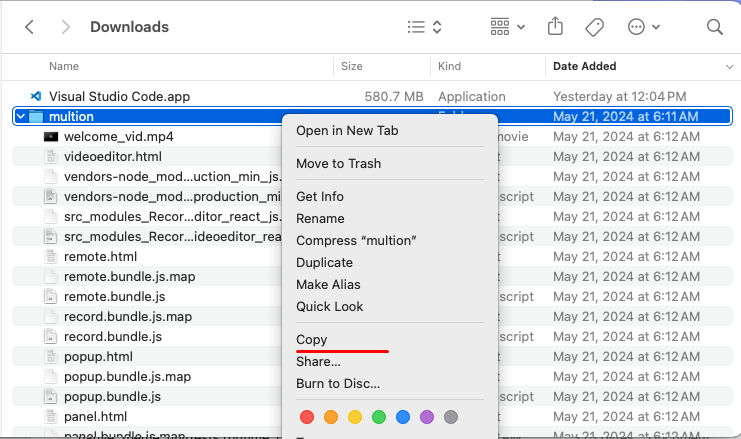
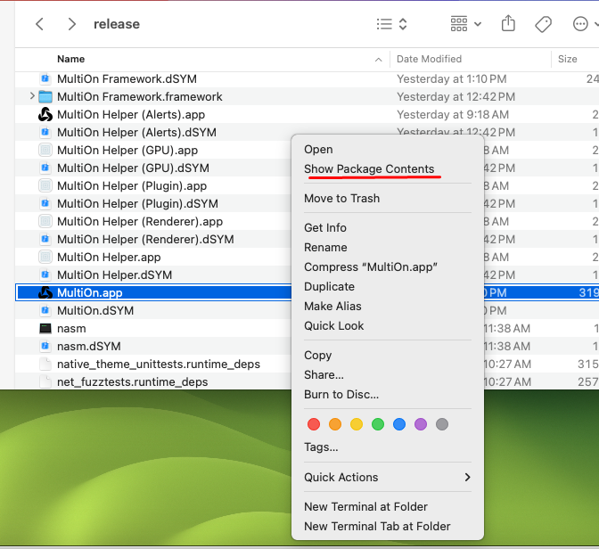
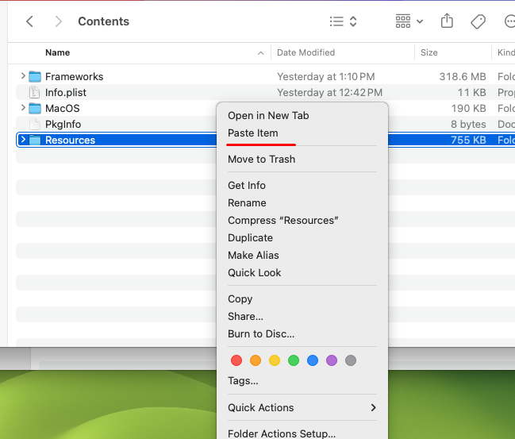
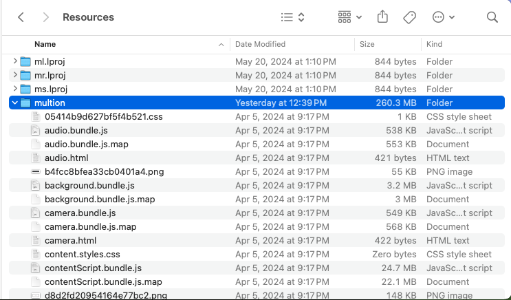
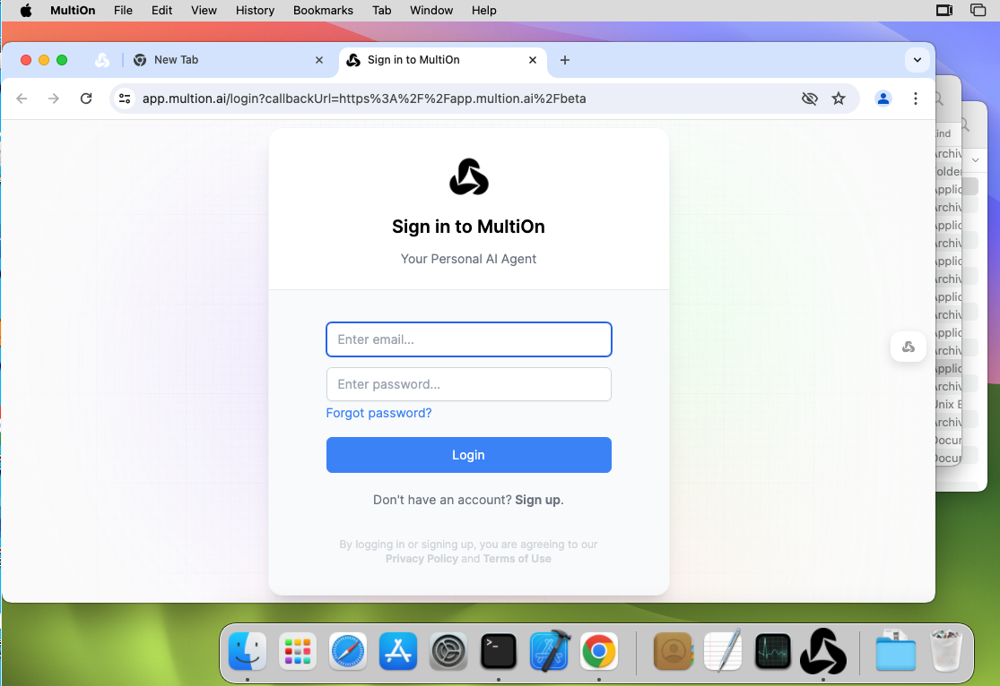

# System requirements
- Install Xcode.
- An APFS-formatted volume (this is the default format for macOS volumes).

# 1. Install depot_tools

Clone the depot_tools repository:

```
$ git clone https://chromium.googlesource.com/chromium/tools/depot_tools.git
```

Add depot_tools to the end of your PATH (you will probably want to put this in your ~/.bash_profile or ~/.zshrc). Assuming you cloned depot_tools to /path/to/depot_tools (note: you must use the absolute path or Python will not be able to find infra tools):

```
$ export PATH="$PATH:/path/to/depot_tools"
```

```
$ gclient
```

# 2. Fetch Chromium

Create a chromium directory for the checkout and change to it. You can call this whatever you like and put it wherever you like, as long as the full path has no spaces.

```
$ mkdir chromium && cd chromium
$ fetch --nohooks --no-history chromium
```

# 3. Checkout

Then we need to check out the specific commit that MultiOnBrowser is based on.

MultiOn Browser is based on commit id : ecbf498e2027dad6dd44ef472b88ad59a0823bb8.

```
$ cd src
$ git fetch https://chromium.googlesource.com/chromium/src.git ecbf498e2027dad6dd44ef472b88ad59a0823bb8 --depth 1
$ git checkout ecbf498e2027dad6dd44ef472b88ad59a0823bb8
```

It will take some mins.

# 4. Synchronize the Source Code

```
$ gclient sync -D
$ gclient runhooks
```

# 5. Clean untracked files.
```
$ git status
$ git add --all
$ git reset --hard HEAD
```

# 6. Setting up the build

Chromium uses Ninja as its main build tool along with a tool called GN to generate .ninja files. You can create any number of build directories with different configurations. To create a build directory:

```
gn gen out/release
```

After "gn gen" command is executed, it will generated out\release folder and some files.
You can see args.gn file and open it in notepad or any text editor.

Write below Chromium build options and save in args.gn :
```
is_component_build = false
is_official_build = true
chrome_pgo_phase = 0
target_cpu = "x64"
is_debug = false
enable_nacl = false
blink_symbol_level = 0
symbol_level = 0
```


# 7. Build chromium

We need to build the checked out chromium first before multion browser patch.

```
$ autoninja -C out/release chrome
```

It will take several hours. (depends on the PC performance)

When the build is finished, you can see Chromium.app in out/release folder. 

You must get the successful build and you have to check build environment again.

# 8. Apply the patches for multion and rebuild

Run git command in chromium/src folder.

```
$ git apply --check /path/to/[patch file name for macos]
```

For example: git apply --check /Users/admin/multion-macos.patch

It must run without any errors.

```
$ git apply /path/to/[patch file name for macos]

$ git status
```
After this, you can check the modified files with git status command.

We need to build again with new patches.

```
$ autoninja -C out/release chrome
```
It will take some mins and you can see MultiOn.app in out/release folder.

# 9. Include the Mullion extension files in MultiOn.app

Copy unpacked multion extension folder. 



Show package contents of MultiOn.app.



Open Contents folder.

Paste the unpacked multion extension folder to the Resources folder.




Run Multion.app




# _How to revert to the commit before applying the patch_?

If the patch file has been modified and you need to revert back to the initial Chromium commit, do the following:

```
$ git add .
$ git reset --hard HEAD
```

This will be reverted to the commit ID ecbf498e2027dad6dd44ef472b88ad59a0823bb8 that you initially checked out.

Repeat again from step 8.