# 1. Install Apple's Certificate Authority certificates

To sign a Chromium app on macOS, you need to download the "Developer ID - G2" and "Worldwide Developer Relations - G3" certificates from [Apple's Certificate Authority](https://www.apple.com/certificateauthority/).
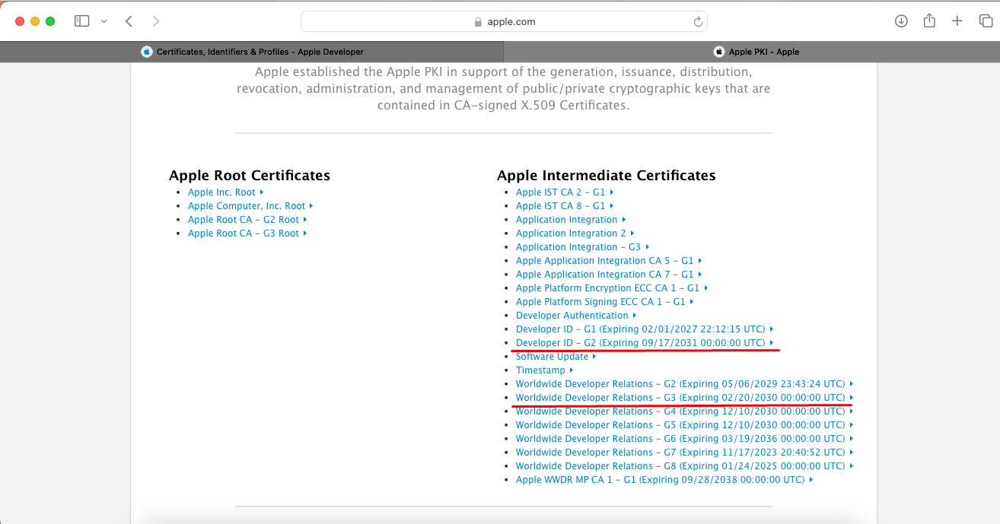

You can install the two downloaded files by double-clicking on them.
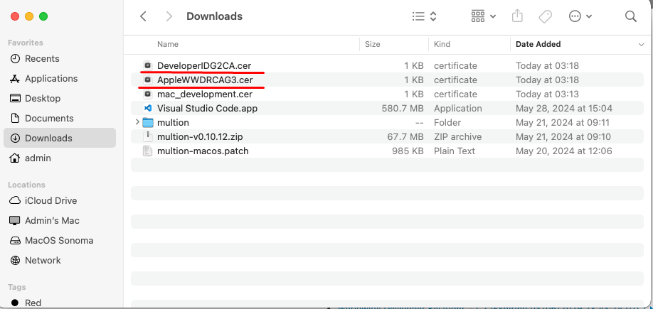

Open Keychain Access.

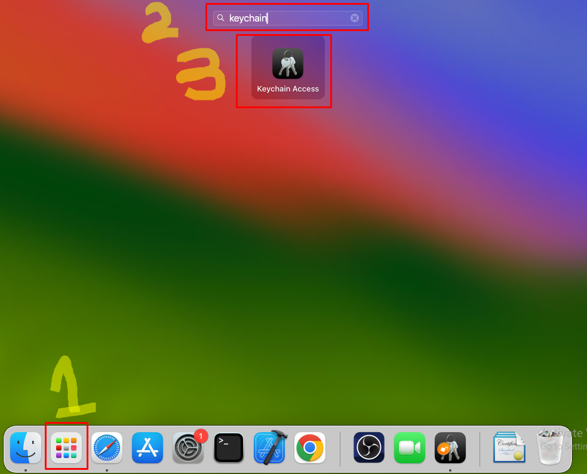

You can see 2 certificates in Keychain Access.

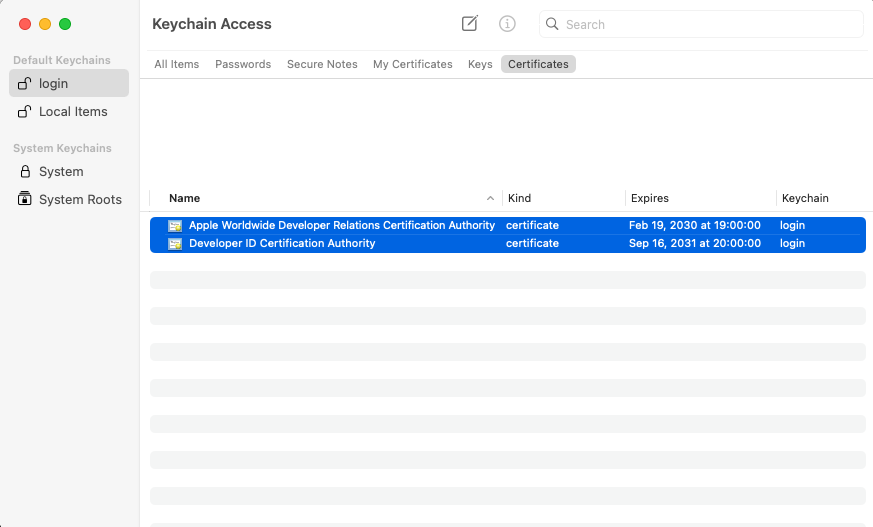

# 2. Create and install "Mac Development" certificate.

Request a Certificate From a Certificate Authority.

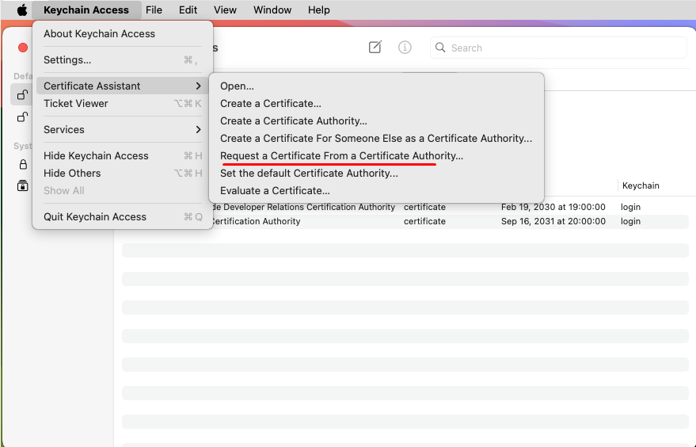
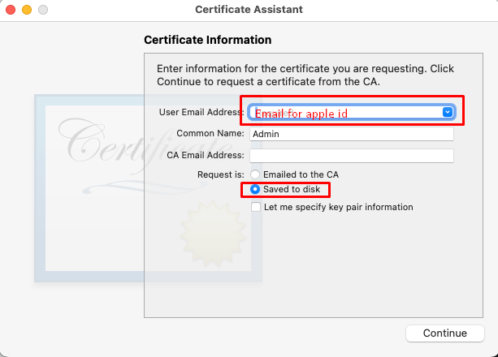
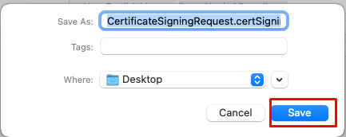

Generated CertificateSigningRequest.certSigningRequest in Desktop.

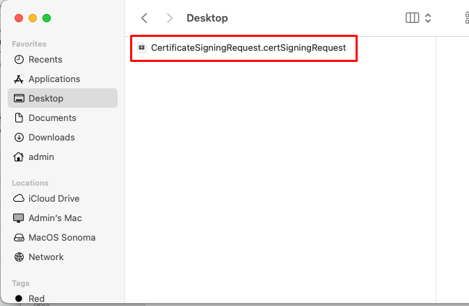


Open the Certificates section on the Apple Developer account.

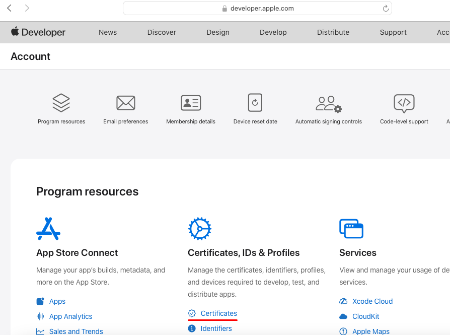

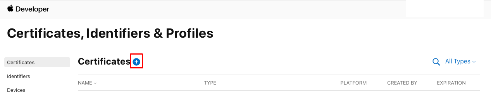

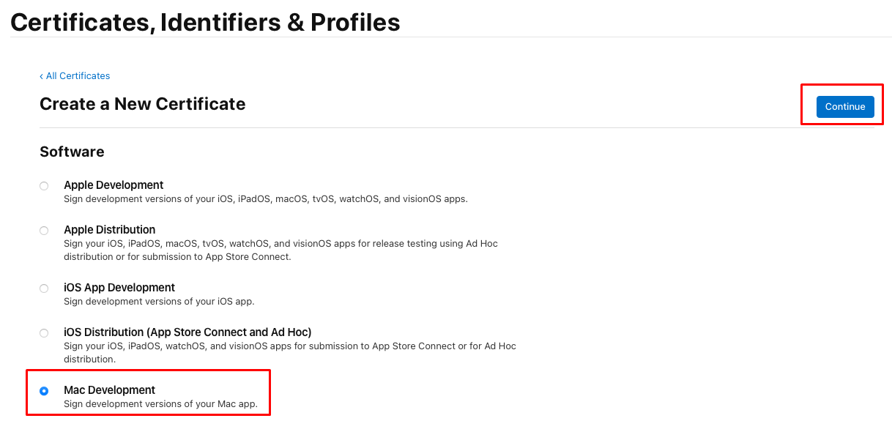

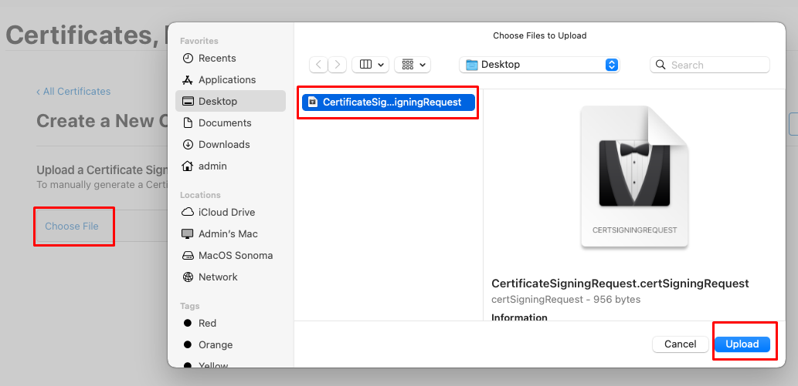

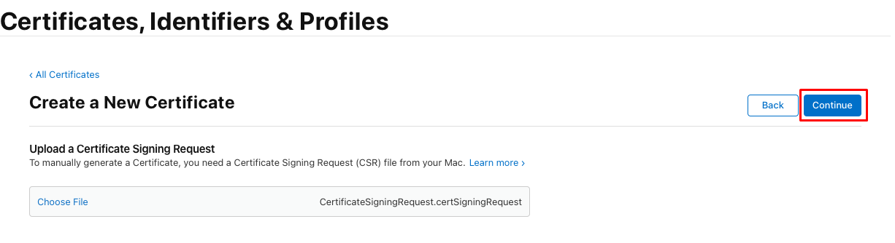

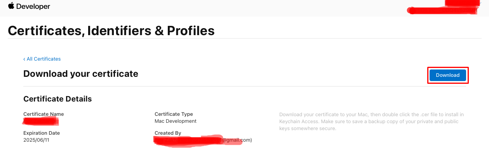

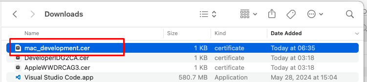

You can install the downloaded certificate file by double-clicking on it.

Mac Development certificate is successfully installed, as shown in the screenshot below.

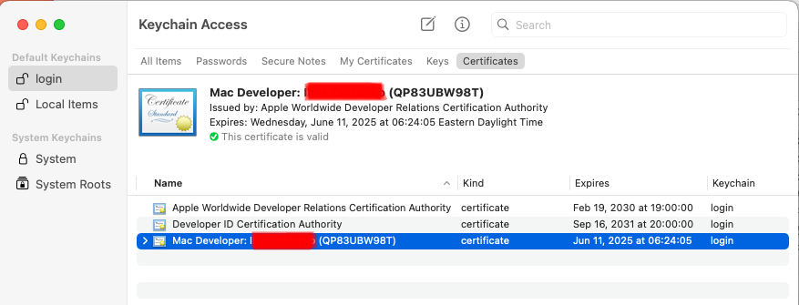


# 3. Sign the MultiOn.app with the Mac Development certificate.

Run the following command in chromium/src folder.

```
$ ninja -C out/release chrome chrome/installer/mac
```

After running the command, you will notice a newly created "MultiOn Packaging" folder in the "out/release" directory.

./out/release/MultiOn\ Packaging/sign_chrome.py --input out/release --output out/release/signed --identity 'Your Mac Developer ID' --development --disable-packaging

You should replace the copied ID from Keychain Access instead of "Your Mac Developer ID."


After above command, you can find the MultiOn.app in the "out/release/signed/stable" folder. 

To check if the sign is correct, you can run the following command:

```
codesign --verify --deep --strict --verbose=2 path/to/MultiOn.app
```

Or

```
codesign -dvvv path/to/MultiOn.app
```

You can run the MultiOn.app on another PC once it has been signed with the Mac Development certificate.

To run it on another PC, simply click "Open" in the right-click menu of the MultiOn.app.

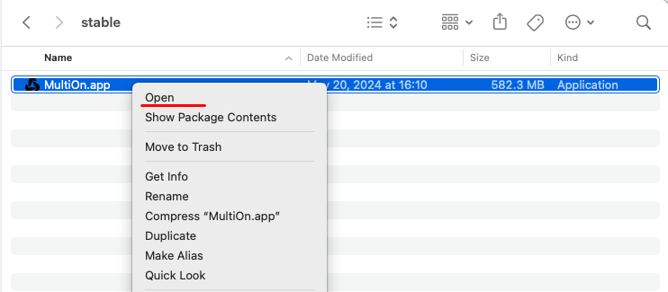
