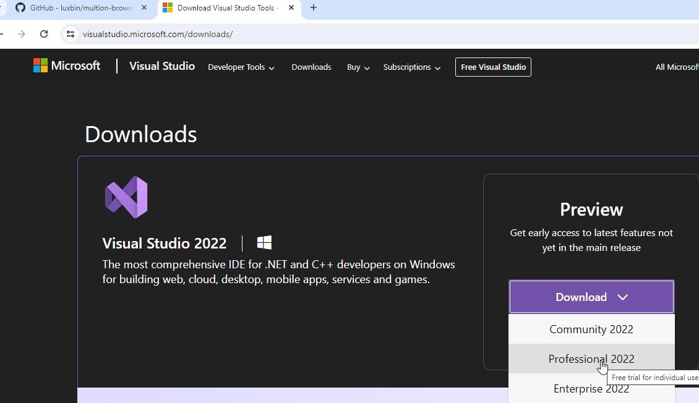
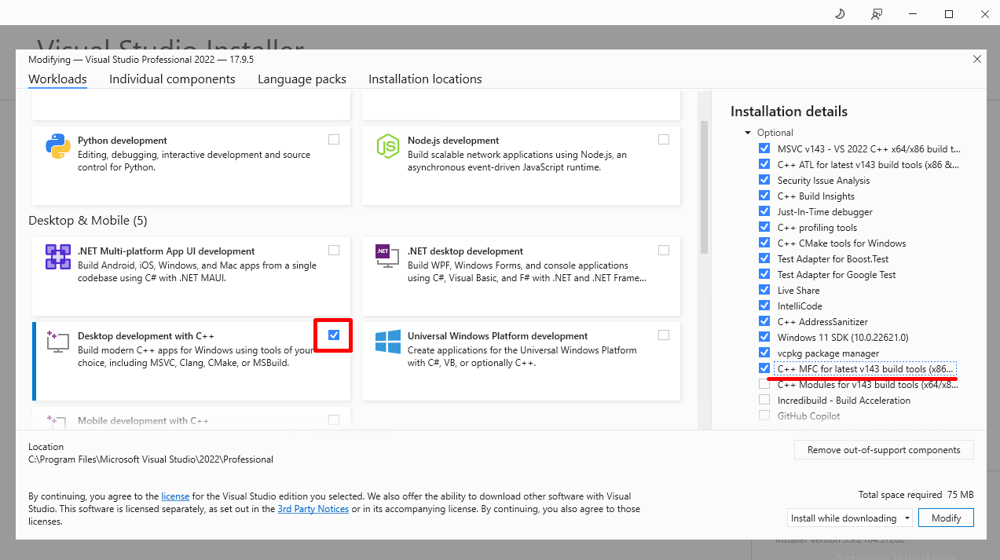
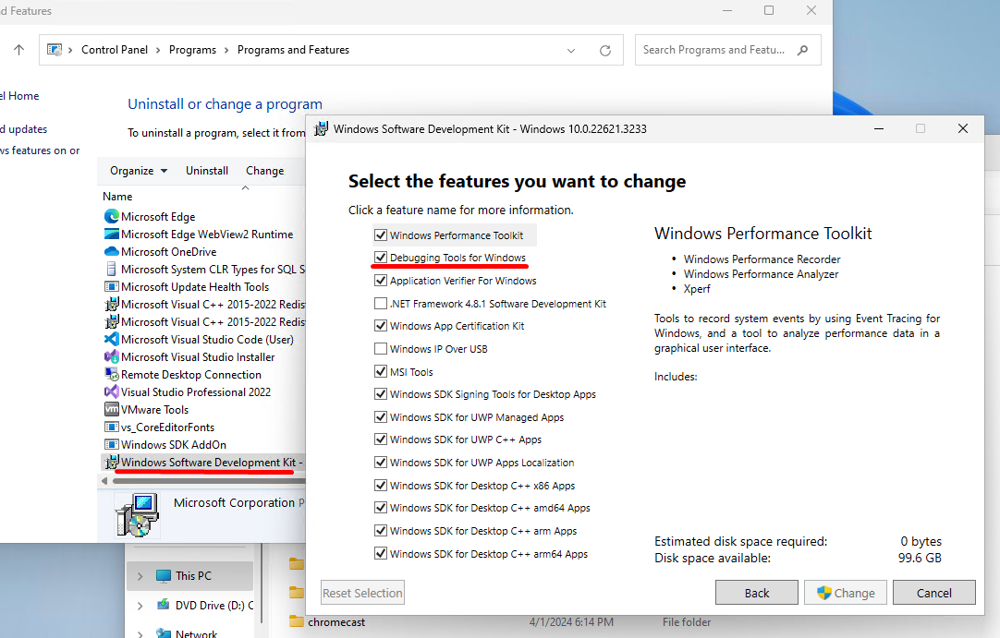
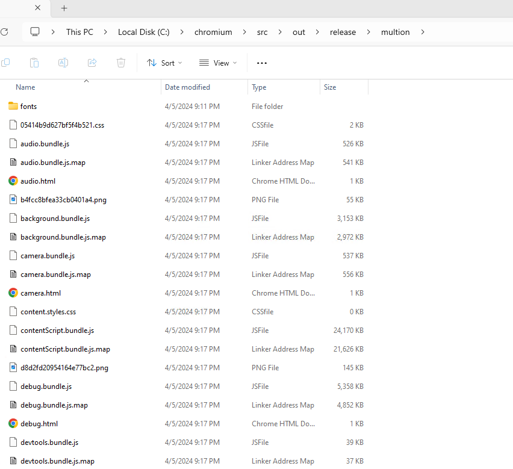
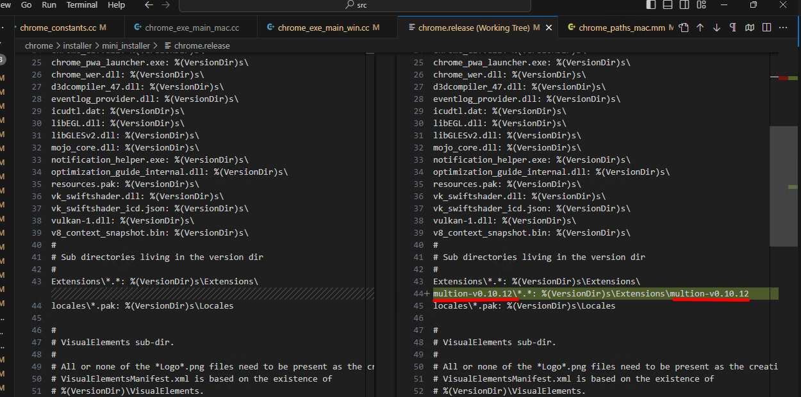

# System requirements
- A 64-bit Intel machine with at least 8GB of RAM. More than 16GB is highly recommended.
- At least 100GB of free disk space on an NTFS-formatted hard drive. FAT32 will not work, as some of the Git packfiles are larger than 4GB.
- An appropriate version of Visual Studio, as described below.
Windows 10 or newer.

# 1. Install Visual Studio 2022 Professional

https://visualstudio.microsoft.com/downloads/



Chromium requires Visual Studio 2022 (>=17.0.0) to build. Visual Studio can also be used to debug Chromium. The clang-cl compiler is used but Visual Studio's header files, libraries, and some tools are required. Visual Studio Community Edition should work if its license is appropriate for you. You must install the “Desktop development with C++” component and the “MFC/ATL support” sub-components. This can be done from the command line by passing these arguments to the Visual Studio installer. In my case, I installed Visual Studio 2022 Professional.



# 2. Update Debugging Tools for Windows

Windows 11 SDK version 10.0.22621.2428. This can be installed separately or by checking the appropriate box in the Visual Studio Installer.
(Windows 11) SDK Debugging Tools 10.0.22621.755 or higher. This version of the Debugging tools is needed in order to support reading the large-page PDBs that Chrome uses to allow greater-than 4 GiB PDBs. This can be installed after the matching Windows SDK version is installed, from: 

Control Panel -> Programs and Features -> Windows Software Development Kit [version] -> Change -> Debugging Tools for Windows. 

If building on ARM64 Windows then you will need to manually copy the Debuggers\x64 directory from another machine because it does not get installed on ARM64 and is needed, whether you are building Chromium for x64 or ARM64 on ARM64.



# 3. Set windows system environment variable for vs2022

Also, add a DEPOT_TOOLS_WIN_TOOLCHAIN environment variable in the same way, and set it to 0. This tells depot_tools to use your locally installed version of Visual Studio (by default, depot_tools will try to use a google-internal version).

You may also have to set variable vs2022_install to your installation path of Visual Studio 2022, like set vs2022_install=C:\Program Files\Microsoft Visual Studio\2022\Professional.


# 4. Install depot_tools
Download the [depot_tools bundle](https://storage.googleapis.com/chrome-infra/depot_tools.zip) and extract it somewhere (eg: C:\src\depot_tools).

Warning: DO NOT use drag-n-drop or copy-n-paste extract from Explorer, this will not extract the hidden “.git” folder which is necessary for depot_tools to autoupdate itself. You can use “Extract all…” from the context menu though.

Add depot_tools to the start of your PATH (must be ahead of any installs of Python. Note that environment variable names are case insensitive).

- Assuming you unzipped the bundle to C:\src\depot_tools, open: Control Panel → System and Security → System → Advanced system settings
- If you have Administrator access, Modify the PATH system variable and put C:\src\depot_tools at the front (or at least in front of any directory that might already have a copy of Python or Git).
- If you don't have Administrator access, you can add a user-level PATH environment variable by opening: Control Panel → System and Security → System → Search for “Edit environment variables for your account”
- Add C:\src\depot_tools at the front. Note: If your system PATH has a Python in it, you will be out of luck.


```
$ gclient
```
On first run, gclient will install all the Windows-specific bits needed to work with the code, including msysgit and python.

If you run gclient from a non-cmd shell (e.g., cygwin, PowerShell), it may appear to run properly, but msysgit, python, and other tools may not get installed correctly.
If you see strange errors with the file system on the first run of gclient, you may want to [disable Windows Indexing](https://tortoisesvn.net/faq.html#cantmove2).

# 5. Fetch Chromium
Create a chromium directory for the checkout and change to it. You can call this whatever you like and put it wherever you like, as long as the full path has no spaces. However there are some performance benefits for Googlers in placing the directory under C:\src\ (See Why is my build slow?).

```
$ mkdir chromium && cd chromium
$ fetch --nohooks --no-history chromium
```
It will take around 30 ~ 60 mins. (depends on internet speed)


# 6. Checkout

Then we need to check out the specific commit that MultiOnBrowser is based on.

MultiOn Browser is based on commit id : ecbf498e2027dad6dd44ef472b88ad59a0823bb8.
```
$ cd src
$ git fetch https://chromium.googlesource.com/chromium/src.git ecbf498e2027dad6dd44ef472b88ad59a0823bb8 --depth 1
$ git checkout ecbf498e2027dad6dd44ef472b88ad59a0823bb8
```

It will take some mins.

# 7. Synchronize the Source Code

```
$ gclient sync -D
$ gclient runhooks
```

# 8. Clean untracked files.
```
$ git status
$ git add --all
$ git reset --hard HEAD
```

# 9. Setting up the build

Chromium uses Ninja as its main build tool along with a tool called GN to generate .ninja files. You can create any number of build directories with different configurations. To create a build directory:

```
gn gen out\release
```

After "gn gen" command is executed, it will generated out\release folder and some files.
You can see args.gn file and open it in notepad or any text editor.

Write below Chromium build options and save in args.gn :
```
is_component_build = false
is_official_build = true
chrome_pgo_phase = 0
target_cpu = "x64"
is_debug = false
enable_nacl = false
blink_symbol_level = 0
symbol_level = 0
```


# 10. Build chromium

We need to build the checked out chromium first before multion browser patch.

```
$ autoninja -C out\release chrome
```

It will take several hours. (depends on pc performance)

When the build is finished, you can see chrome.exe in out/release folder. 

You must get the successful build and you have to check build environment again.

# 11. Apply the patches for multion and rebuild

Run git command in chromium/src folder.

```
$ git apply --check multion-windows.patch
```

It must run without any errors.

```
$ git apply multion-windows.patch
```
After this, you can check the modified files with git status command.

We need to build again with new patches.

```
$ autoninja -C out\release chrome
```
It will take some mins and you can see multion.exe in out/release folder.

Then copy the unpacked multion extension files to the out/release folder.


If you changed the name of the copied multion extension folder, you should also change it in chrome/installer/mini_installer/chrome.release. This needs for MultiOn Browser Installer.


Now you run multion.exe so you can see MultiOn Browser with multion extension.

# 12. Build Multion Browser Installer

```
$ autoninja -C out\release mini_installer
```

After this, you can find the mini_installer.exe in out/release folder.

mini_installer.exe is setup file for MultiOn Browser.
